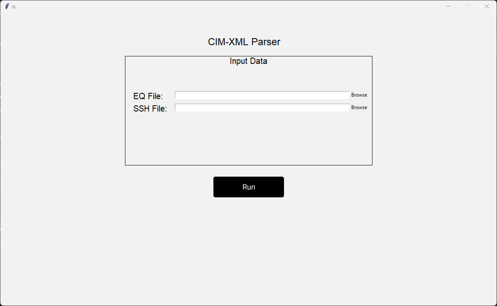
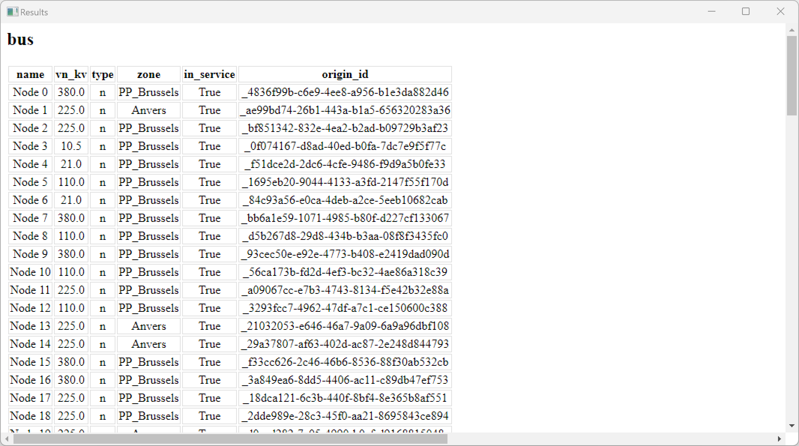

# EH2745 Assignment 1

A desktop application that converts EQ and SSH XML files from the Common Information Model to a PandaPower network. The results can be viewed in the built-in GUI. 

## Features
* Fully-functional and intuitive GUI
* Browsable imports of EQ and SSH XML files
* Is able to handle MOST cases of EQ and SSH XML Files
* Handles connections between certain missing Connectivity Nodes
* Plots the results in a graph
* Provides information about equipment in the network
* Catches errors gracefully

## Python Files Included
Project is created with:
* `CIMXMLParser.py`: Contains the class `CIM_XML_parser`
* `PandaPowerManager.py`: Contains the class `PandaPowerWriter`
* `gui.py`: Contains GUI-related information

